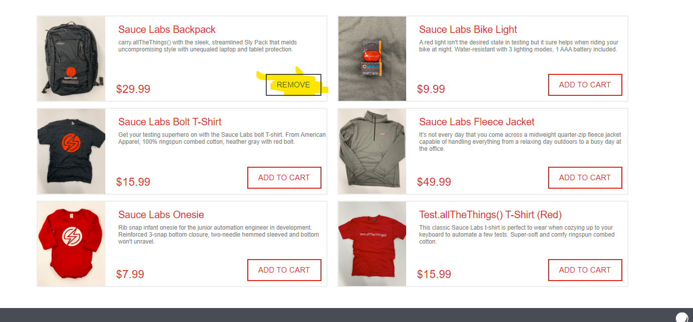

# vox-tecnologia-desafio

## Cenários propostos:
- **Login**: Teste o login com um usuário válido e inválido.
- **Visualização de Produtos**: Teste a visualização da lista de produtos após o login.
- **Adicionar ao Carrinho**: Teste a adição de um ou mais produtos ao carrinho.
- **Remover do Carrinho**: Teste a remoção de produtos do carrinho.
- **Finalizar Compra**: Teste o fluxo de finalização de compra.

## Bug Encontrado:
- Não podemos adicionar mais de uma unidade por item.

